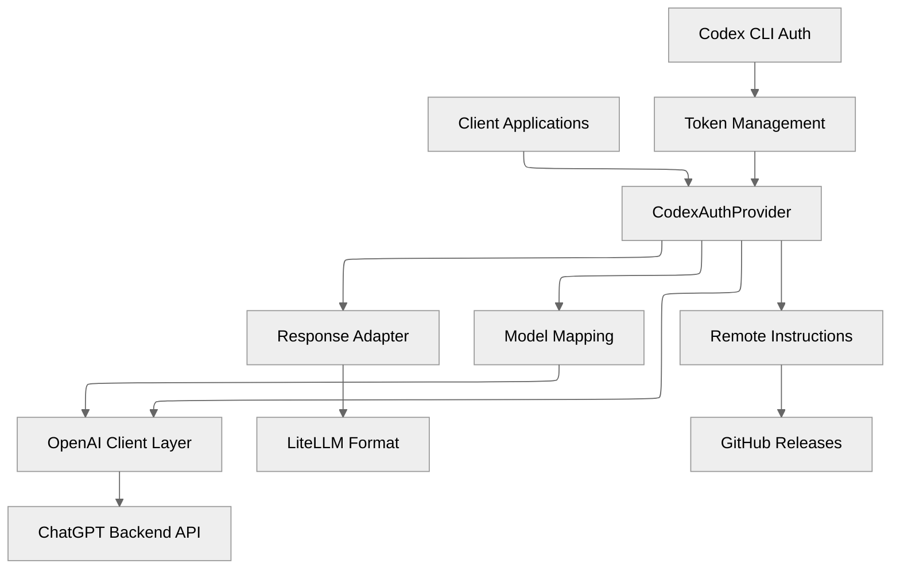
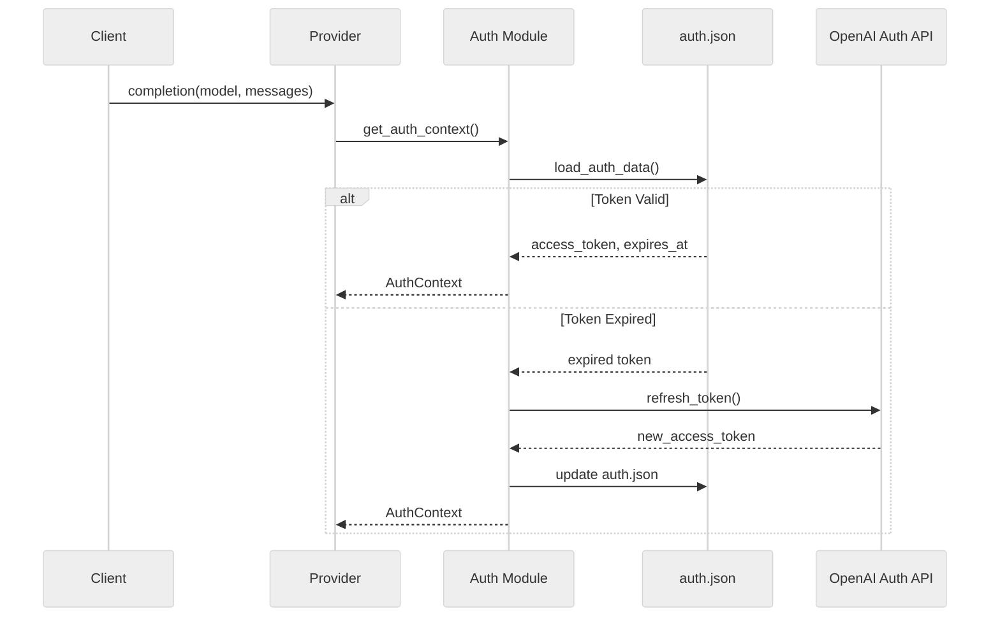
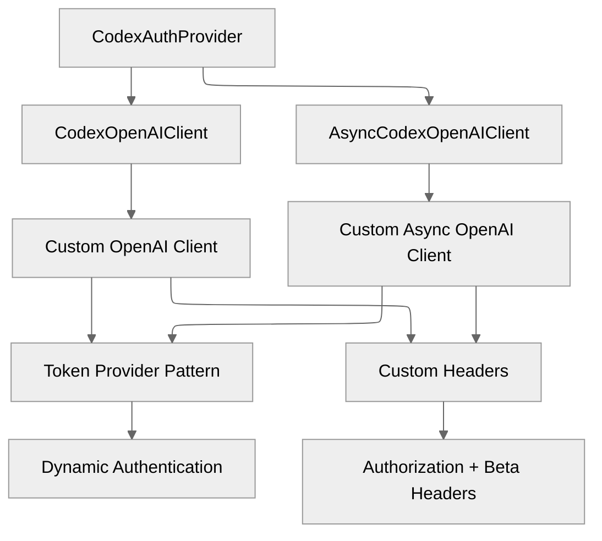
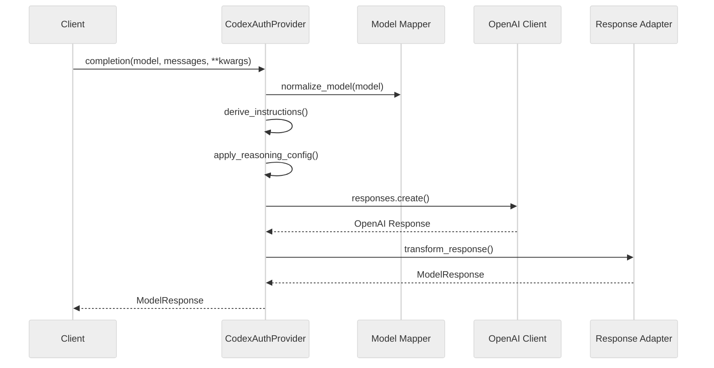
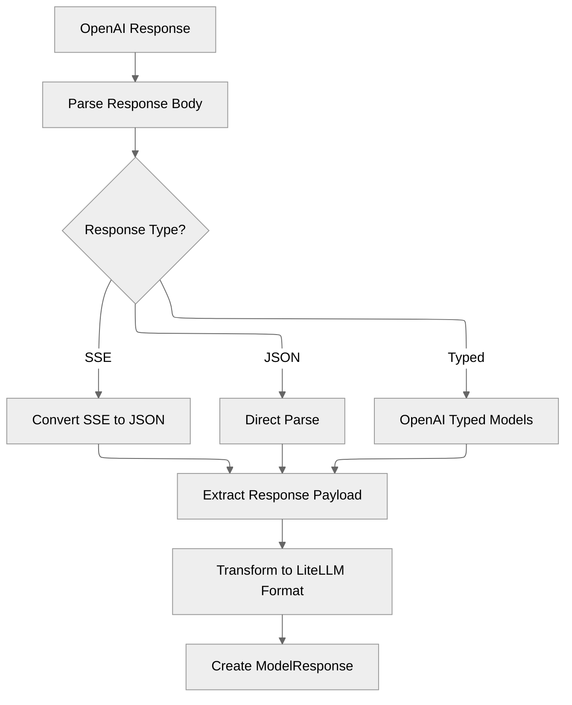

# Architecture Overview

The LiteLLM Codex OAuth Provider is a sophisticated adapter that bridges Codex CLI authentication with OpenAI-compatible APIs through a modern architecture using the official OpenAI client library. This document provides a comprehensive architectural overview of the system.

## System Architecture



### 1. Authentication Layer (`auth.py`)

The authentication layer manages the complete token lifecycle:

- **Token Extraction**: Reads and validates Codex CLI authentication tokens
- **Account ID Decoding**: Extracts ChatGPT account ID from JWT claims
- **Token Refresh**: Automatically refreshes expired tokens via OpenAI OAuth API
- **Error Handling**: Provides specific exceptions for different auth failure modes



### 2. OpenAI Client Integration (`openai_client.py`)

The OpenAI client layer provides Codex-specific customization of the official OpenAI client:

#### Custom Client Architecture



#### Key Customizations

1. **Token Provider Pattern**: Dynamic token retrieval from provider
2. **Custom Header Injection**: Codex-specific headers added to all requests
3. **Account ID Resolution**: Automatic ChatGPT account ID injection
4. **Beta Feature Headers**: Required OpenAI beta headers for Codex API

```python
# Custom header injection example
headers = httpx.Headers(prepared.headers or {})
headers["Authorization"] = f"Bearer {token}"
headers.setdefault("OpenAI-Beta", "responses=experimental")
headers.setdefault("originator", "codex_cli_rs")
headers.setdefault("Content-Type", "application/json")
headers["Accept"] = "text/event-stream"
if account_id:
    headers.setdefault("chatgpt-account-id", account_id)
```

### 3. Core Provider (`provider.py`)

The `CodexAuthProvider` class orchestrates the entire request/response pipeline:

#### Request Processing Flow



#### Key Responsibilities

1. **Model Normalization**: Converts LiteLLM model strings to Codex-compatible identifiers
2. **Request Orchestration**: Coordinates between OpenAI client and response adapter
3. **Client Delegation**: Manages sync/async OpenAI client instances
4. **Configuration Resolution**: Handles base URL and mode detection

### 4. Response Adapter (`adapter.py`)

The response adapter provides pure functions for transforming Codex responses to LiteLLM format:

#### Response Transformation Pipeline



#### Key Features

1. **OpenAI Typed Models**: Uses official OpenAI response models for validation
2. **SSE Processing**: Handles Server-Sent Events with fallback mechanisms
3. **Flexible Parsing**: Multiple parsing strategies for different response formats
4. **Tool Call Extraction**: Comprehensive tool call handling from various formats

### 5. Remote Resources (`remote_resources.py`)

Manages dynamic instruction fetching and caching from GitHub releases. The system automatically downloads and caches Codex instructions for different model families, with support for ETag validation and TTL-based expiration to minimize unnecessary network requests.

### 6. Model Mapping (`model_map.py`)

Handles intelligent model name normalization and alias resolution. The system automatically converts LiteLLM model strings (like `codex/gpt-5.1-codex-low`) to Codex-compatible identifiers through a series of transformations including provider prefix stripping, normalization rules, and alias mapping.

## Data Flow Architecture

### Request Pipeline

The provider processes requests through a streamlined pipeline that handles model normalization, instruction derivation, and OpenAI client delegation. Each step is designed to be efficient and maintainable.

### Response Transformation Pipeline

The response transformation pipeline handles multiple response formats from the Codex backend, ensuring compatibility with LiteLLM's expected format through robust parsing and transformation logic.

## Configuration Architecture

### Environment Variables

The provider supports several environment variables for configuration:

| Variable | Default | Description |
|----------|---------|-------------|
| `CODEX_AUTH_FILE` | `~/.codex/auth.json` | Path to auth file |
| `CODEX_CACHE_DIR` | `~/.opencode/cache` | Instruction cache directory |
| `CODEX_MODE` | `True` | Enable Codex-specific features |
| `CODEX_DEBUG` | `False` | Enable debug logging |

### Client Configuration

The provider automatically configures OpenAI clients with appropriate settings:

- **Base URL**: Automatically resolved based on environment
- **Timeout**: 60 seconds for requests, 20 seconds for GitHub operations
- **Token Provider**: Dynamic token retrieval from auth context
- **Account ID Provider**: Automatic ChatGPT account ID resolution

## Performance Considerations

### Caching Strategy

1. **Token Caching**: In-memory cache with 5-minute buffer
2. **Instruction Caching**: File-based cache with 15-minute TTL and ETag support
3. **Model Mapping**: Static dictionary lookup (O(1))

### Client Optimization

1. **Connection Reuse**: OpenAI client manages connection pooling
2. **Timeout Management**: 60s request timeout, 20s GitHub timeout
3. **Async Support**: Full async/await support for concurrent requests

### Response Processing

1. **Typed Model Validation**: OpenAI typed models for reliable parsing
2. **Fallback Mechanisms**: Multiple parsing strategies for robustness
3. **Efficient Transformation**: Pure functions for predictable performance

## Extension Points

### Custom OpenAI Client

Extend the OpenAI client customization:

```python
class CustomCodexClient(CodexOpenAIClient):
    def _prepare_options(self, options: FinalRequestOptions) -> FinalRequestOptions:
        prepared = super()._prepare_options(options)
        # Add custom headers or modifications
        headers = httpx.Headers(prepared.headers or {})
        headers["Custom-Header"] = "custom-value"
        return prepared.copy(update={"headers": headers})
```

### Custom Response Adapter

Override response transformation:

```python
def custom_transform_response(openai_response: dict[str, Any], model: str) -> ModelResponse:
    # Custom transformation logic
    return transform_response(openai_response, model)
```

### Custom Model Mapping

Extend model normalization:

```python
# Add custom model aliases
alias_bases = {
    "custom-model": "target-base-model",
    # ... more aliases
}
```

## Migration from Previous Architecture

### Key Changes

1. **HTTP Transport**: Replaced direct httpx with OpenAI client library
2. **Response Handling**: Extracted to separate adapter module
3. **Authentication**: Token provider pattern for dynamic token retrieval
4. **Error Handling**: OpenAI typed models with comprehensive fallbacks
5. **Simplification**: Removed Cloudflare workarounds and browser emulation

### Benefits

1. **Better Reliability**: Official OpenAI client with proven stability
2. **Improved Maintainability**: Clear separation of concerns
3. **Enhanced Testability**: Pure functions and dependency injection
4. **Future Compatibility**: Aligned with OpenAI ecosystem evolution

This architecture provides a robust, maintainable, and extensible foundation for integrating Codex authentication with OpenAI-compatible APIs while maintaining full compatibility with the LiteLLM ecosystem.
