# Architecture Overview

The LiteLLM Codex OAuth Provider is a sophisticated adapter that bridges Codex CLI authentication with OpenAI-compatible APIs. This document provides a comprehensive architectural overview of the system.

## System Architecture

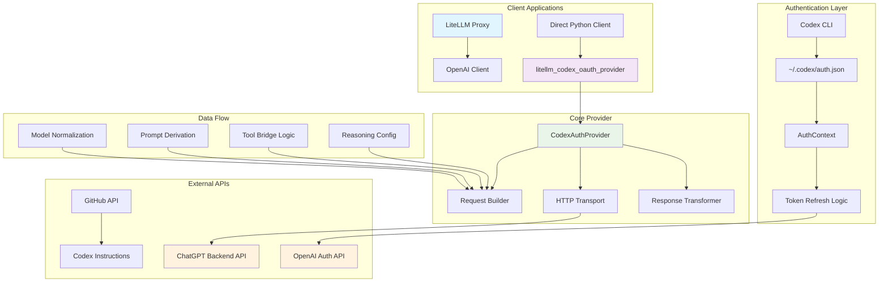

## Component Overview

### 1. Authentication Layer (`auth.py`)

The authentication layer manages the complete token lifecycle:

- **Token Extraction**: Reads and validates Codex CLI authentication tokens
- **Account ID Decoding**: Extracts ChatGPT account ID from JWT claims
- **Token Refresh**: Automatically refreshes expired tokens via OpenAI OAuth API
- **Error Handling**: Provides specific exceptions for different auth failure modes

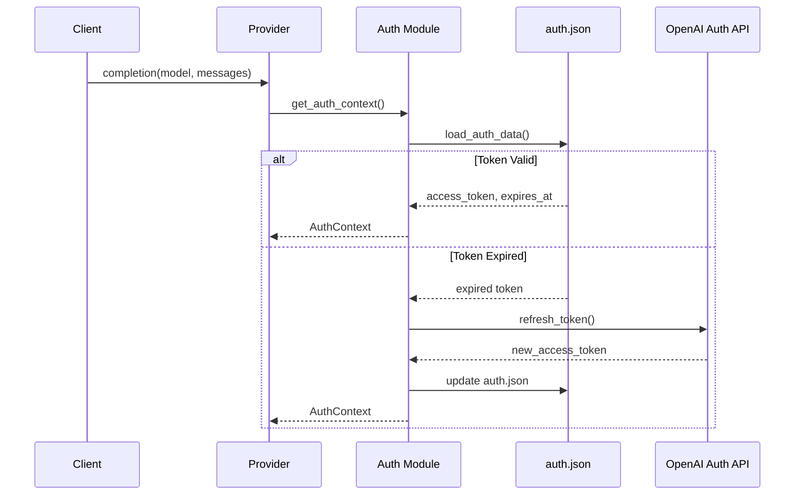

### 2. Core Provider (`provider.py`)

The `CodexAuthProvider` class orchestrates the entire request/response pipeline:

#### Request Processing Flow

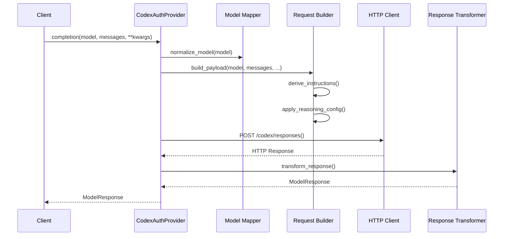

#### Key Responsibilities

1. **Model Normalization**: Converts LiteLLM model strings to Codex-compatible identifiers
2. **Request Building**: Constructs Codex API payloads from LiteLLM parameters
3. **HTTP Transport**: Handles network communication with timeout and error handling
4. **Response Transformation**: Converts Codex responses to LiteLLM format
5. **Streaming Support**: Provides both sync and async streaming interfaces

### 3. Model Mapping (`model_map.py`)

Handles intelligent model name normalization and alias resolution:

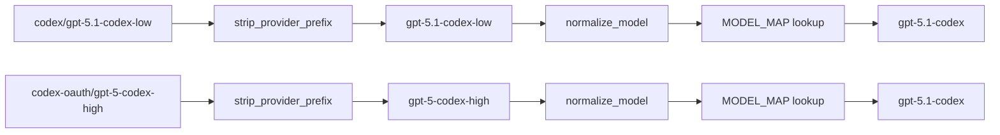

### 4. Prompt Management (`prompts.py`)

Manages dynamic instruction fetching and caching:

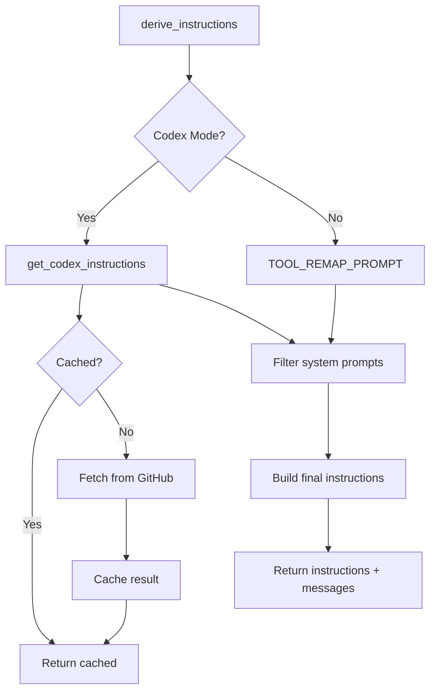

### 5. Reasoning Configuration (`reasoning.py`)

Applies model-specific reasoning constraints and effort clamping:

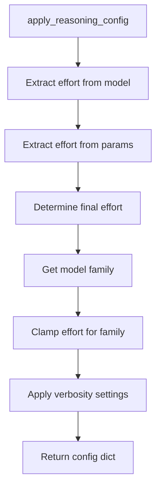

## Data Flow Architecture

### Request Pipeline

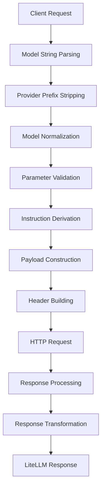

### Response Transformation Pipeline

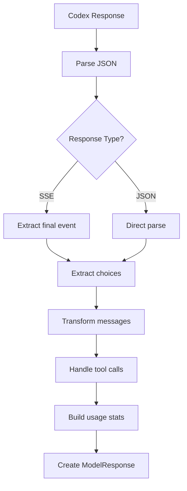

## Security Architecture

### Token Security

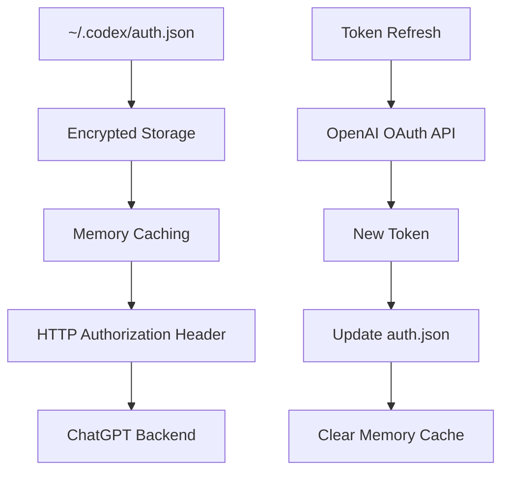

### Error Handling Strategy

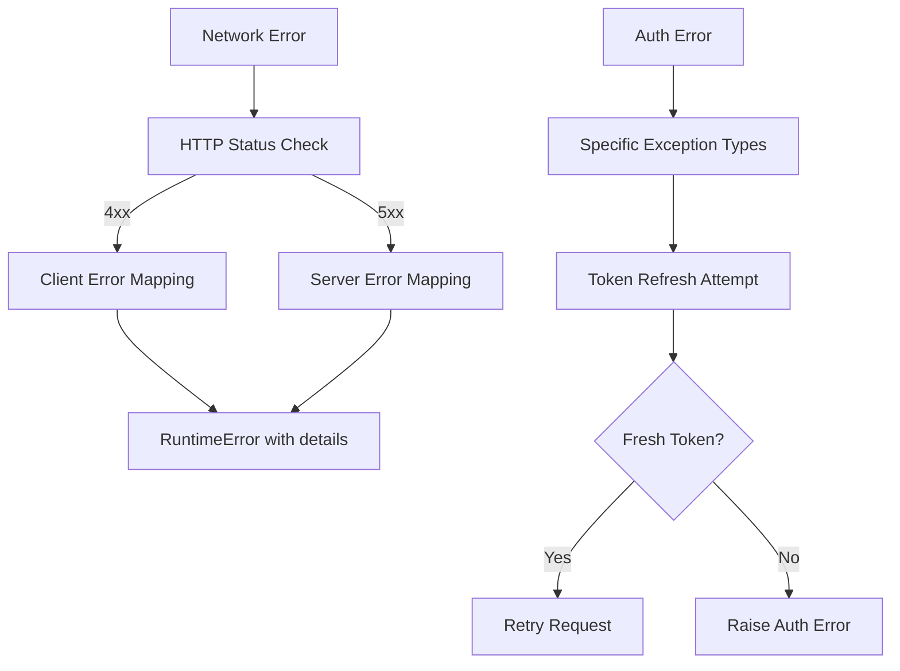

## Configuration Architecture

### Environment Variables

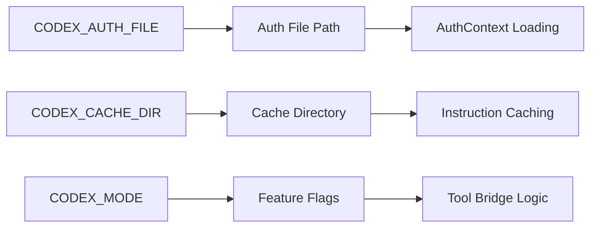

### Model Configuration

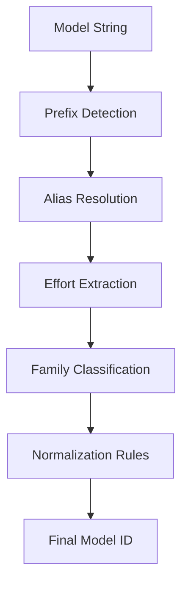

## Performance Considerations

### Caching Strategy

1. **Token Caching**: In-memory cache with 5-minute buffer
2. **Instruction Caching**: File-based cache with 15-minute TTL
3. **Model Mapping**: Static dictionary lookup (O(1))

### Network Optimization

1. **Connection Pooling**: httpx client reuse
2. **Timeout Management**: 60s request timeout, 20s GitHub timeout
3. **Retry Logic**: Automatic token refresh on auth failures

## Extension Points

### Custom Model Support

The system supports custom model additions through the `MODEL_MAP` in `model_map.py`:

```python
# Add custom model aliases
alias_bases = {
    "custom-model": "target-base-model",
    # ... more aliases
}
```

### Custom Prompt Logic

Extend `derive_instructions()` in `prompts.py` to add custom instruction logic:

```python
def derive_instructions(messages, *, codex_mode, normalized_model):
    # Custom logic here
    return instructions, filtered_messages
```

### Custom Response Transformation

Override or extend `_transform_response()` in `provider.py` for custom response handling:

```python
def _transform_response(self, openai_response: dict[str, Any], model: str) -> ModelResponse:
    # Custom transformation logic
    return transformed_response
```
