# Codex API Integration Details

This document provides comprehensive details about how the provider wraps the Codex backend API using the official OpenAI client library, including request/response handling, authentication flow, and internal processing details.

## Codex Backend API Overview

The provider acts as a sophisticated adapter between LiteLLM's OpenAI-compatible interface and the ChatGPT backend API through the official OpenAI client library. It handles the complete request/response lifecycle while maintaining compatibility with both systems.

## OpenAI Client Integration Architecture

### Custom OpenAI Client Implementation

The provider uses a custom OpenAI client that extends the official OpenAI client with Codex-specific authentication and header injection:

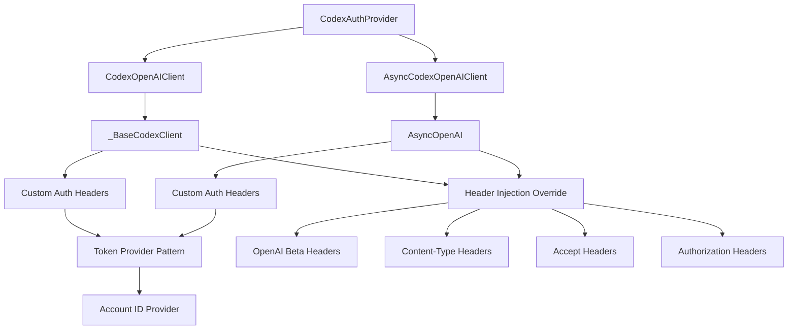

### Token Provider Pattern

The OpenAI client uses a token provider pattern for dynamic authentication:

```python
class _BaseCodexClient(OpenAI):
    def __init__(
        self,
        *,
        token_provider: Callable[[], str],
        account_id_provider: Callable[[], str | None],
        base_url: str,
        timeout: float = 60.0,
        http_client: httpx.Client | None = None,
        **kwargs: Any,
    ) -> None:
        # Initialize with empty API key - we'll inject auth headers
        super().__init__(
            api_key="",
            base_url=base_url,
            timeout=timeout,
            http_client=client,
            **kwargs,
        )
        self._token_provider = token_provider
        self._account_id_provider = account_id_provider
```

### Custom Header Injection

The provider overrides the `_prepare_options` method to inject Codex-specific headers:

```python
@override
def _prepare_options(self, options: FinalRequestOptions) -> FinalRequestOptions:
    prepared = super()._prepare_options(options)
    headers = httpx.Headers(prepared.headers or {})

    # Inject dynamic token
    token = self._token_provider()
    if token:
        headers["Authorization"] = f"Bearer {token}"

    # Inject Codex-specific headers
    headers.setdefault("OpenAI-Beta", "responses=experimental")
    headers.setdefault("originator", "codex_cli_rs")
    headers.setdefault("Content-Type", "application/json")
    headers["Accept"] = "text/event-stream"

    # Inject account ID if available
    account_id = self._account_id_provider() or ""
    if account_id:
        headers.setdefault("chatgpt-account-id", account_id)

    return prepared.copy(update={"headers": headers})
```

## Request Processing Details

### Model Normalization Process

The provider performs intelligent model name normalization to map LiteLLM model strings to Codex-compatible identifiers:

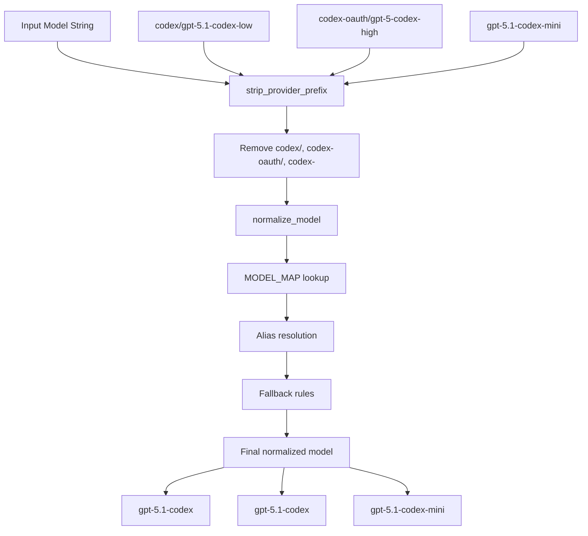

### Request Payload Construction

The provider transforms LiteLLM parameters into Codex API payloads:

```python
def _build_payload(
    self,
    *,
    model: str,
    instructions: str,
    messages: list[dict[str, Any]],
    prompt_cache_key: str | None,
    reasoning_config: dict[str, Any],
    **kwargs: Any,
) -> dict[str, Any]:
```

#### Payload Structure

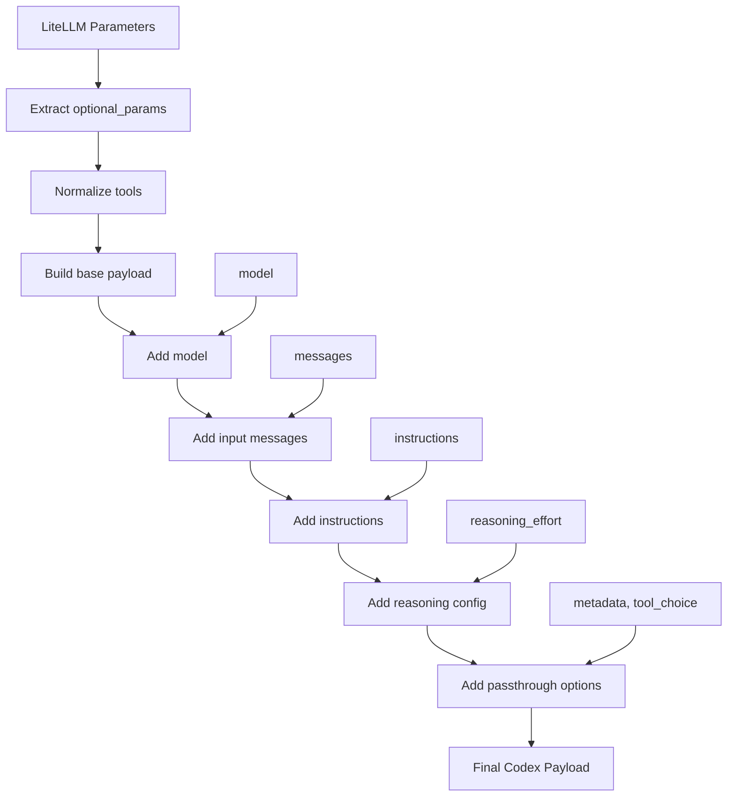

#### Key Payload Fields

| Field | Type | Description | Source |
|-------|------|-------------|---------|
| `model` | `str` | Normalized Codex model identifier | Model mapping |
| `input` | `list[dict]` | Transformed message array | Message conversion |
| `instructions` | `str` | System instructions | Remote resources |
| `tools` | `list[dict]` | Normalized tool definitions | Tool processing |
| `reasoning.effort` | `str` | Reasoning effort level | Config application |
| `text.verbosity` | `str` | Response verbosity | Config application |
| `include` | `list[str]` | Include encrypted reasoning | Constants |
| `stream` | `bool` | Enable streaming | Always `True` |

### Message Transformation

The provider converts OpenAI message format to Codex input format:

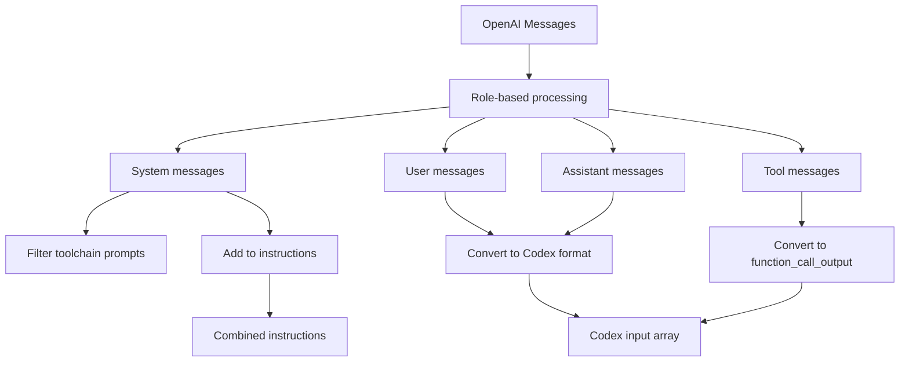

#### Message Type Conversions

| OpenAI Role | Codex Type | Transformation |
|-------------|------------|----------------|
| `system` | `instructions` | Filtered and combined |
| `user` | `message` | Direct conversion |
| `assistant` | `message` | Direct conversion |
| `tool` | `function_call_output` | Special handling |
| `function` | `function_call` | Legacy support |

### Tool Bridge Logic

When tools are present, the provider prepends a special bridge prompt:

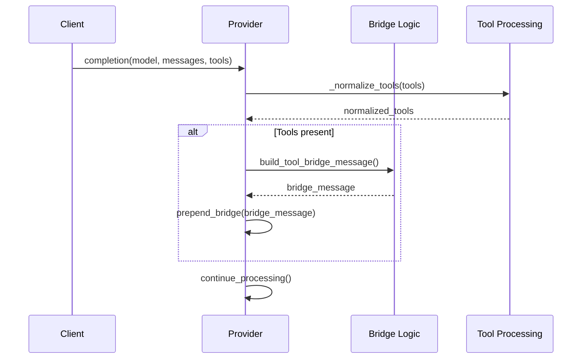

## Response Processing Details

### Response Type Detection

The provider handles multiple response formats from the Codex backend:

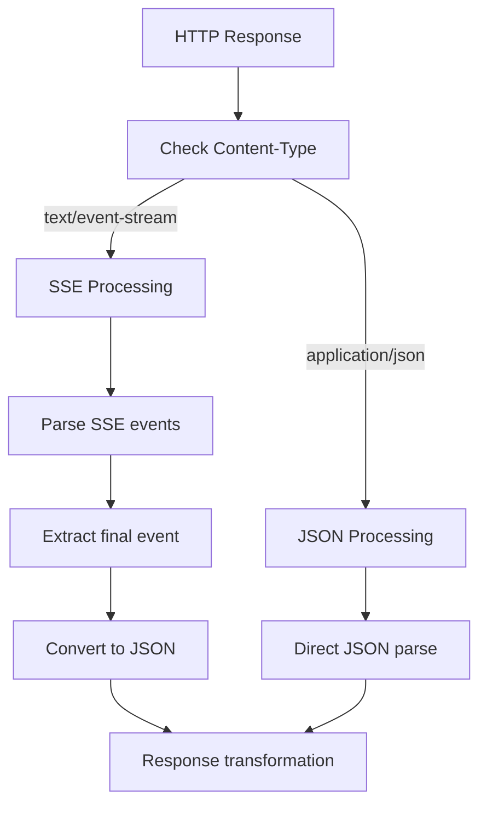

### SSE Event Processing

For streaming responses, the provider processes Server-Sent Events:

```python
def convert_sse_to_json(payload: str) -> dict[str, Any]:
    """Convert buffered SSE text to final JSON payload."""
    events = []
    for line in payload.splitlines():
        if not line.startswith("data:"):
            continue
        data = line.removeprefix("data:").strip()
        if not data or data == "[DONE]":
            continue
        try:
            event = json.loads(data)
        except json.JSONDecodeError:
            continue
        if isinstance(event, Mapping):
            events.append(event)

    validated = _extract_validated_response_from_events(events)
    if validated:
        return validated

    return _extract_response_from_events(events)
```

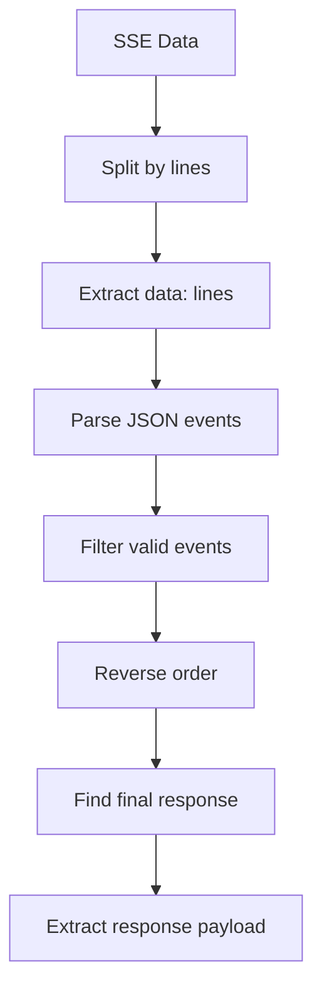

### Response Transformation Pipeline

The provider performs complex transformation from Codex format to LiteLLM format:

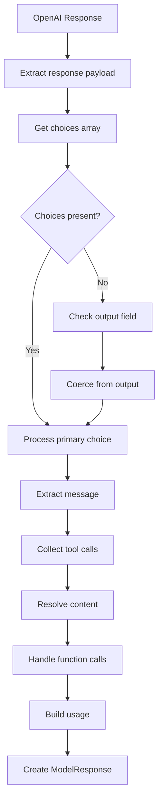

#### Choice Processing Logic

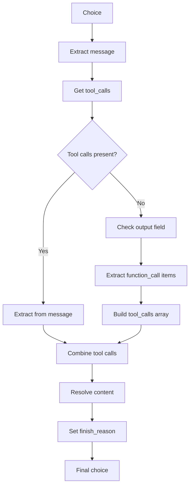

### Tool Call Extraction

The provider handles multiple tool call formats:

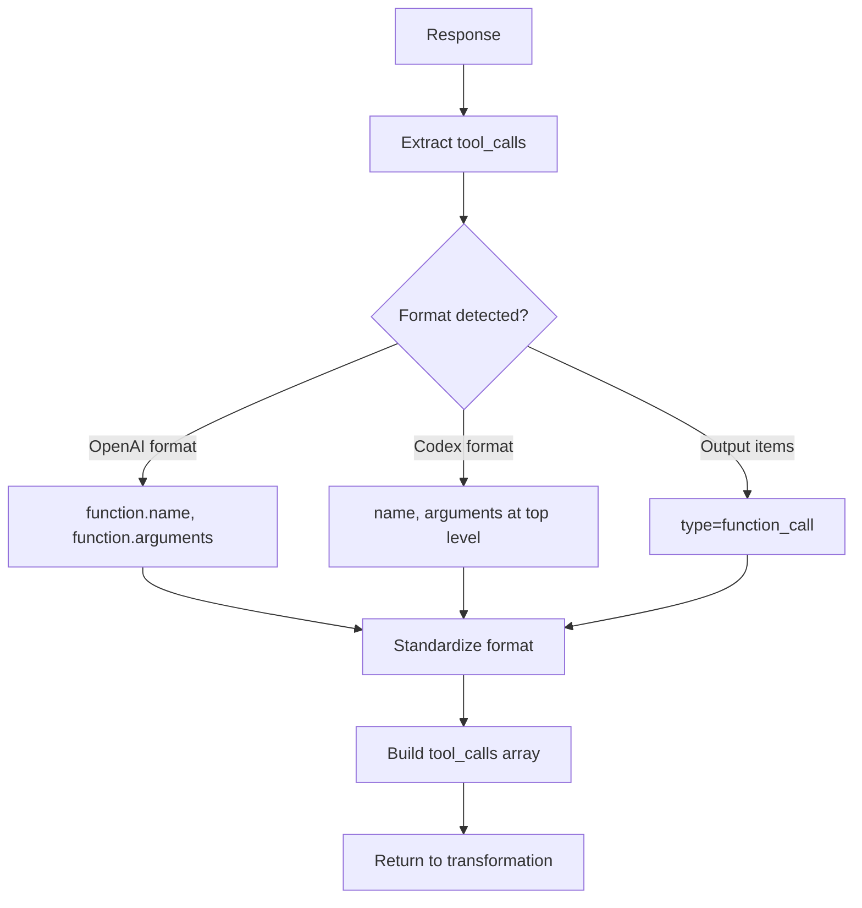

## Authentication Flow Details

### Token Lifecycle Management

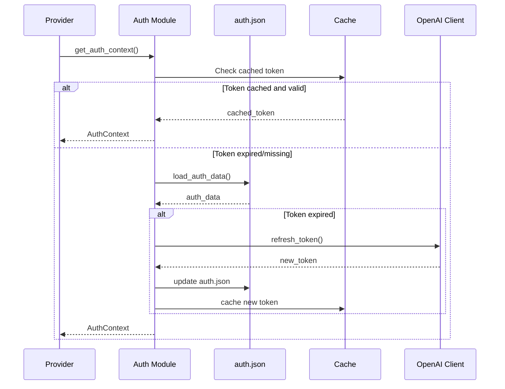

### JWT Account ID Extraction

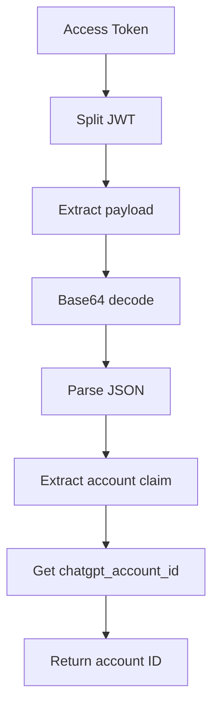

### OpenAI Client Authentication

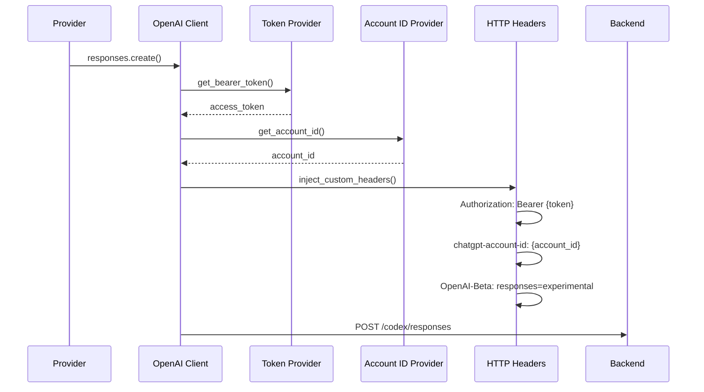

## HTTP Dispatch Architecture

### Fallback Mechanism

The provider uses a fallback mechanism when OpenAI client dispatch fails:

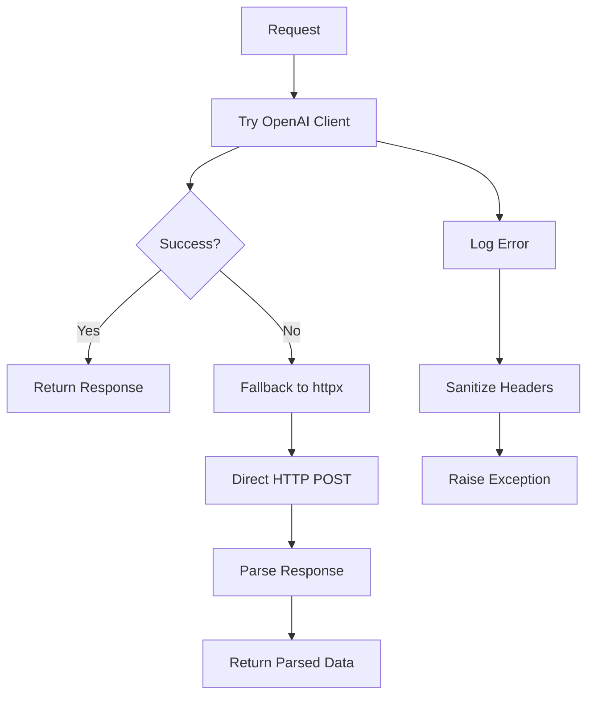

### HTTP Client Configuration

```python
def _create_http_client(base_url: str, timeout: float) -> httpx.Client:
    return httpx.Client(base_url=base_url, timeout=timeout, follow_redirects=True)

def _create_async_http_client(base_url: str, timeout: float) -> httpx.AsyncClient:
    return httpx.AsyncClient(base_url=base_url, timeout=timeout, follow_redirects=True)
```

## Error Handling Strategy

### HTTP Error Processing

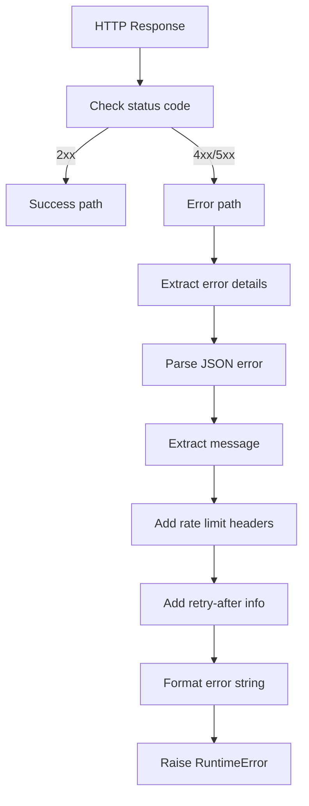

### Network Error Handling

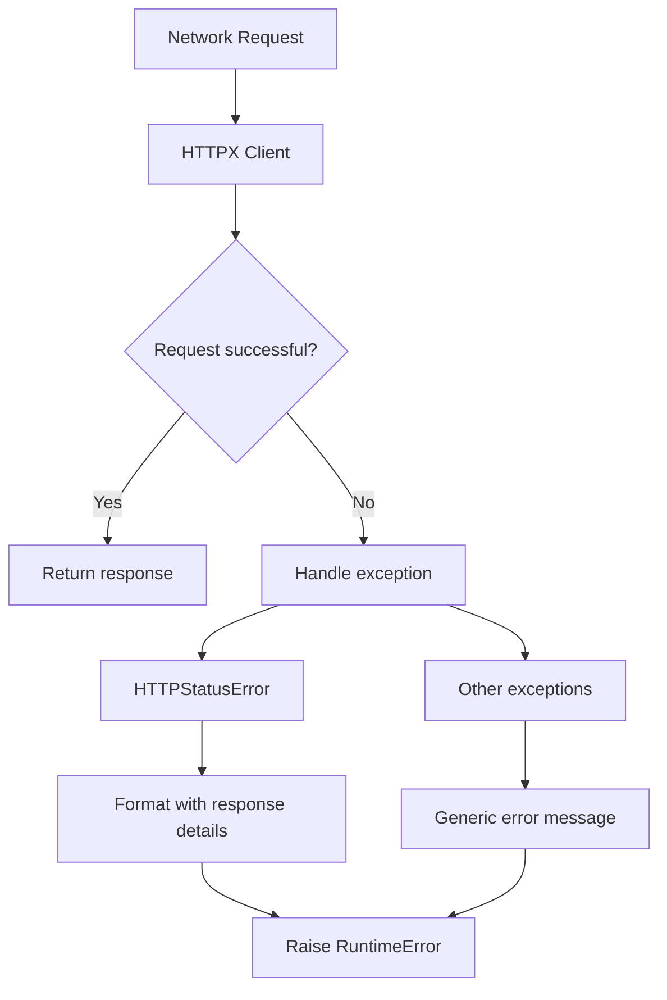

## Remote Resources Management

### Instruction Fetching and Caching

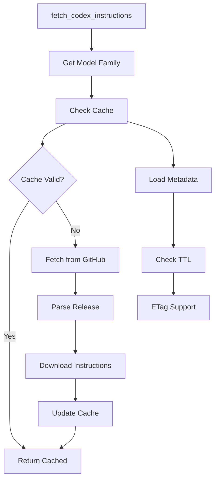

### Cache Management

```python
@dataclass(slots=True)
class CacheMetadata:
    """Metadata for cached Codex instructions."""
    etag: str | None
    tag: str | None
    last_checked: float | None
    url: str | None

def _should_use_cache(metadata: CacheMetadata, cached: str | None, now: float) -> bool:
    if metadata.last_checked is None or cached is None:
        return False
    return now - float(metadata.last_checked) < constants.CODEX_INSTRUCTIONS_CACHE_TTL_SECONDS
```

## Configuration and Constants

### Environment Variables

| Variable | Default | Description |
|----------|---------|-------------|
| `CODEX_AUTH_FILE` | `~/.codex/auth.json` | Path to auth file |
| `CODEX_CACHE_DIR` | `~/.opencode/cache` | Instruction cache directory |
| `CODEX_MODE` | `True` | Enable Codex-specific features |
| `CODEX_DEBUG` | `False` | Enable debug logging |

### API Endpoints

| Endpoint | Purpose | Timeout |
|----------|---------|---------|
| `https://chatgpt.com/backend-api/codex/responses` | Main API endpoint | 60s |
| `https://auth.openai.com/oauth/token` | Token refresh | 20s |
| `https://api.github.com/repos/openai/codex/releases/latest` | Get latest release | 20s |

### Model Mapping Constants

```python
MODEL_EFFORT_SUFFIXES = ("none", "minimal", "low", "medium", "high", "xhigh")
BASE_MODELS = ("gpt-5.1-codex", "gpt-5.1-codex-max", "gpt-5.1-codex-mini", "gpt-5.1")
```

## Performance Optimizations

### Caching Strategy

1. **Token Caching**: 5-minute buffer before expiry
2. **Instruction Caching**: 15-minute TTL with ETag support
3. **Model Mapping**: Static dictionary (O(1) lookup)

### Client Optimization

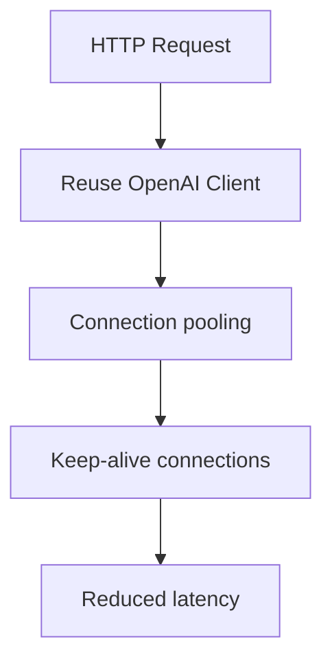

### Response Processing

1. **Typed Model Validation**: OpenAI typed models for reliable parsing
2. **Fallback Mechanisms**: Multiple parsing strategies for robustness
3. **Efficient Transformation**: Pure functions for predictable performance

## Security Considerations

### Token Security

- Tokens stored in user home directory with appropriate permissions
- Memory caching with automatic expiration
- No token logging or persistence beyond necessary

### Request Security

- HTTPS-only communication
- Proper header sanitization
- Input validation for all parameters

### Error Information

- Detailed error messages for debugging
- Rate limit information preservation
- No sensitive data in error responses

## Customization Points

### Custom OpenAI Client

Extend the OpenAI client customization:

```python
class CustomCodexClient(CodexOpenAIClient):
    def _prepare_options(self, options: FinalRequestOptions) -> FinalRequestOptions:
        prepared = super()._prepare_options(options)
        # Add custom headers or modifications
        headers = httpx.Headers(prepared.headers or {})
        headers["Custom-Header"] = "custom-value"
        return prepared.copy(update={"headers": headers})
```

### Custom Response Adapter

Override response transformation:

```python
def custom_transform_response(openai_response: dict[str, Any], model: str) -> ModelResponse:
    # Custom transformation logic
    return transform_response(openai_response, model)
```

### Custom Model Mapping

Extend model normalization:

```python
# Add custom model aliases
alias_bases = {
    "custom-model": "target-base-model",
    # ... more aliases
}
```

This architecture provides a robust, maintainable, and extensible foundation for integrating Codex authentication with OpenAI-compatible APIs while maintaining full compatibility with the LiteLLM ecosystem.
