# Codex API Integration Details

This document provides comprehensive details about how the provider wraps the Codex backend API, including request/response handling, authentication flow, and internal processing details.

## Codex Backend API Overview

The provider acts as a sophisticated adapter between LiteLLM's OpenAI-compatible interface and the ChatGPT backend API. It handles the complete request/response lifecycle while maintaining compatibility with both systems.

## Request Processing Details

### Model Normalization Process

The provider performs intelligent model name normalization to map LiteLLM model strings to Codex-compatible identifiers:

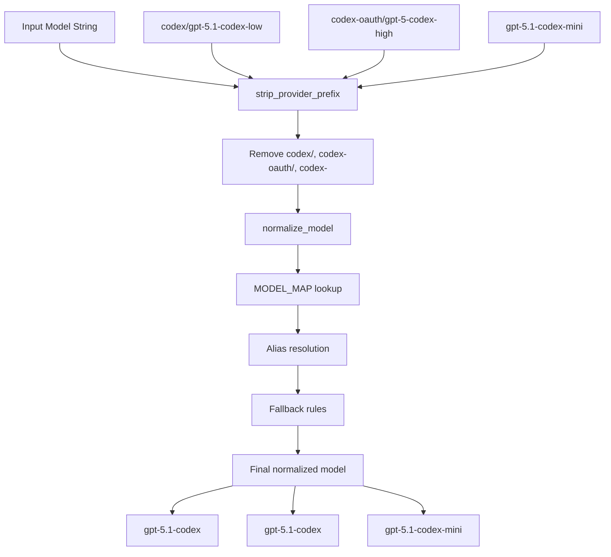

### Request Payload Construction

The provider transforms LiteLLM parameters into Codex API payloads:

```python
def _build_payload(
    self,
    *,
    model: str,
    instructions: str,
    messages: list[dict[str, Any]],
    prompt_cache_key: str | None,
    reasoning_config: dict[str, Any],
    **kwargs: Any,
) -> dict[str, Any]:
```

#### Payload Structure

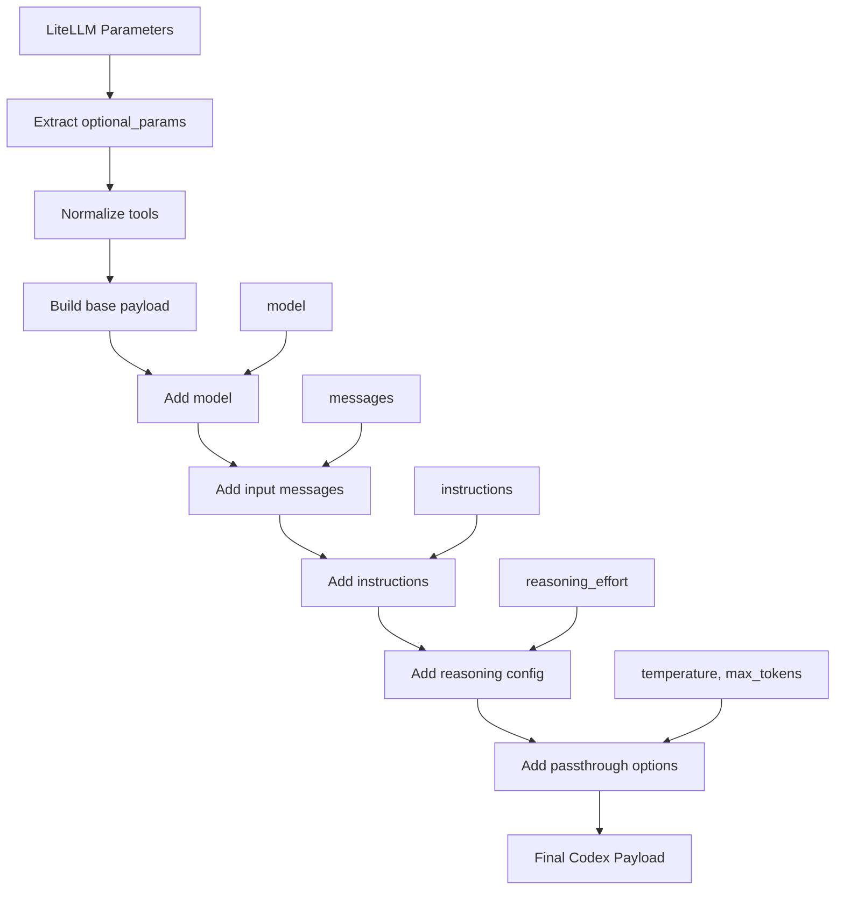

#### Key Payload Fields

| Field | Type | Description | Source |
|-------|------|-------------|---------|
| `model` | `str` | Normalized Codex model identifier | Model mapping |
| `input` | `list[dict]` | Transformed message array | Message conversion |
| `instructions` | `str` | System instructions | Prompt derivation |
| `tools` | `list[dict]` | Normalized tool definitions | Tool processing |
| `reasoning.effort` | `str` | Reasoning effort level | Config application |
| `text.verbosity` | `str` | Response verbosity | Config application |
| `include` | `list[str]` | Include encrypted reasoning | Constants |
| `stream` | `bool` | Enable streaming | Always `True` |

### Message Transformation

The provider converts OpenAI message format to Codex input format:

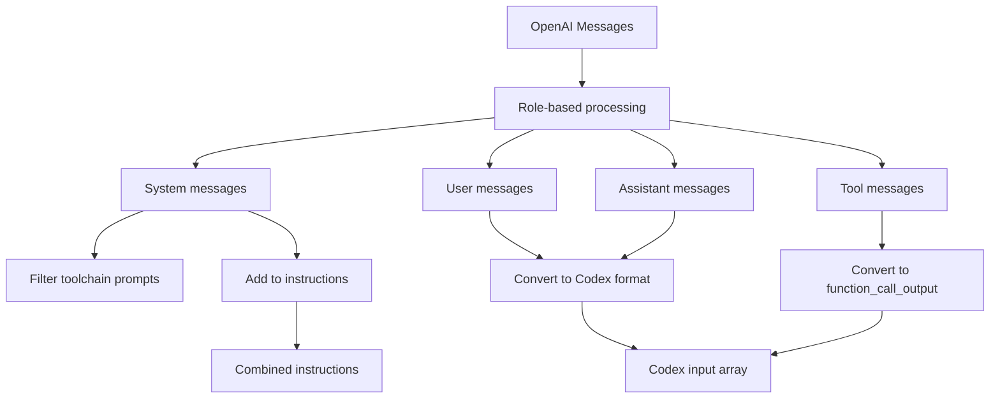

#### Message Type Conversions

| OpenAI Role | Codex Type | Transformation |
|-------------|------------|----------------|
| `system` | `instructions` | Filtered and combined |
| `user` | `message` | Direct conversion |
| `assistant` | `message` | Direct conversion |
| `tool` | `function_call_output` | Special handling |
| `function` | `function_call` | Legacy support |

### Tool Bridge Logic

When tools are present, the provider prepends a special bridge prompt:

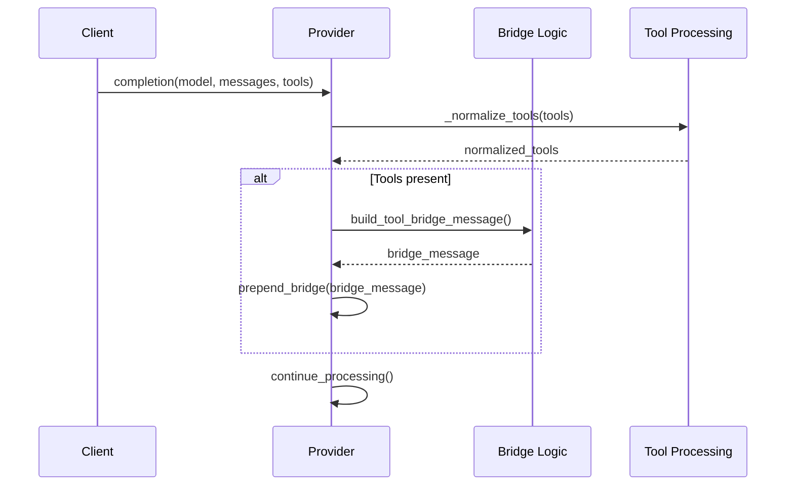

## Response Processing Details

### Response Type Detection

The provider handles multiple response formats from the Codex backend:

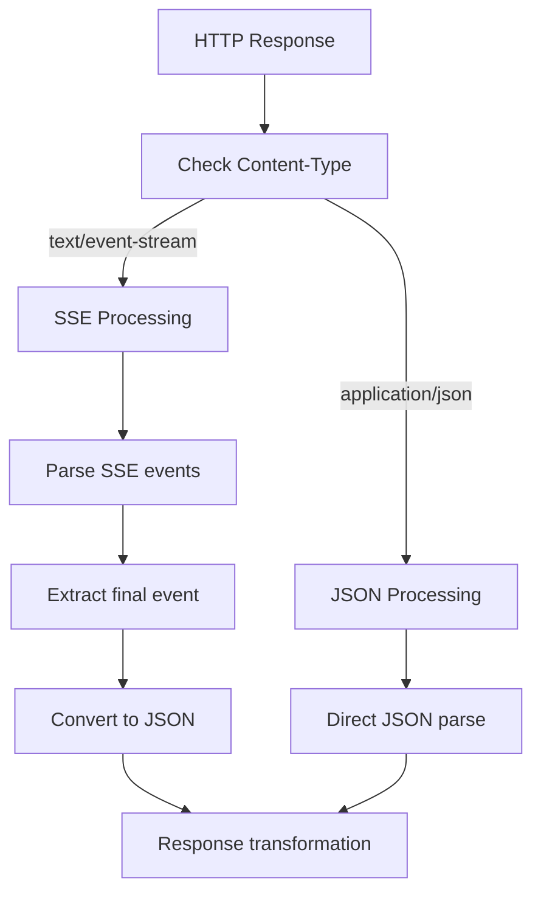

### SSE Event Processing

For streaming responses, the provider processes Server-Sent Events:

```python
@staticmethod
def _convert_sse_to_json(payload: str) -> dict[str, Any]:
    """Convert buffered SSE text to final JSON payload."""
    events = []
    for line in payload.splitlines():
        if not line.startswith("data:"):
            continue
        data = line.removeprefix("data:").strip()
        if not data or data == "[DONE]":
            continue
        try:
            event = json.loads(data)
        except json.JSONDecodeError:
            continue
        if isinstance(event, Mapping):
            events.append(event)

    return CodexAuthProvider._extract_response_from_events(events)
```

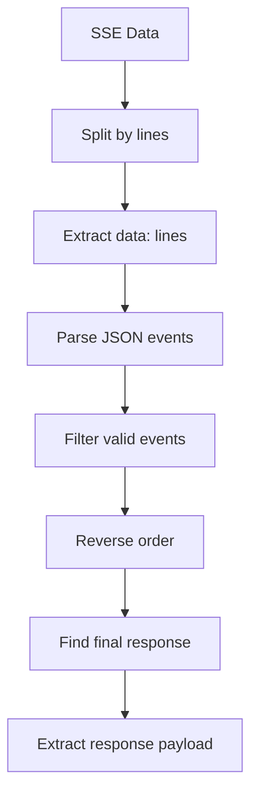

### Response Transformation Pipeline

The provider performs complex transformation from Codex format to LiteLLM format:

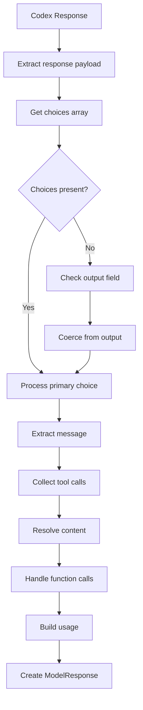

#### Choice Processing Logic

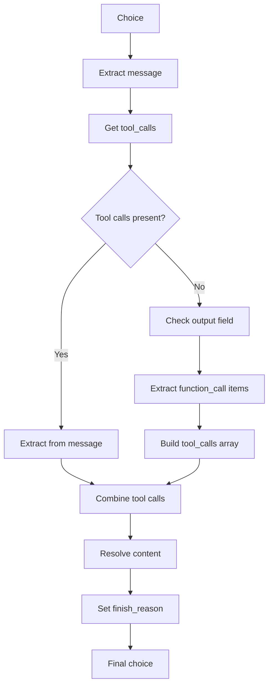

### Tool Call Extraction

The provider handles multiple tool call formats:

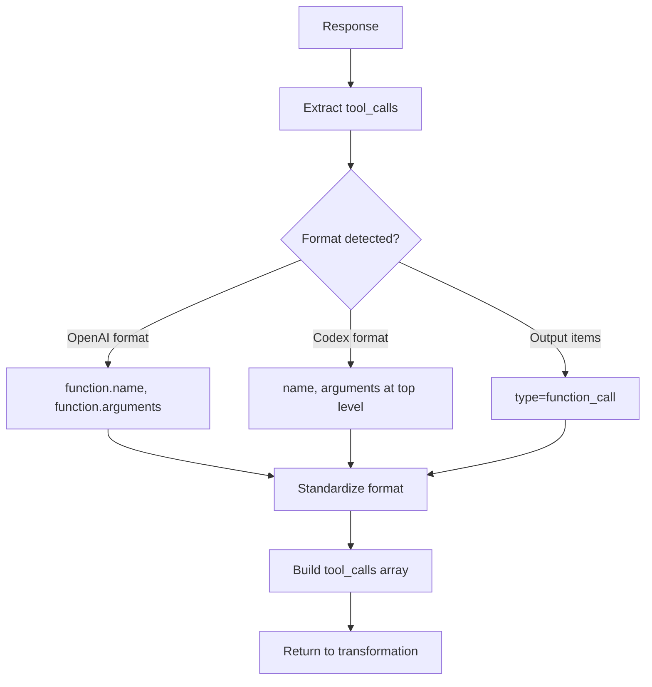

## Authentication Flow Details

### Token Lifecycle Management


### JWT Account ID Extraction

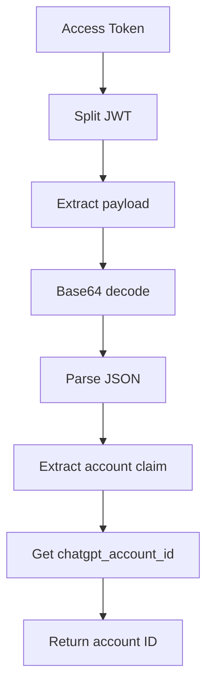

## Error Handling Strategy

### HTTP Error Processing

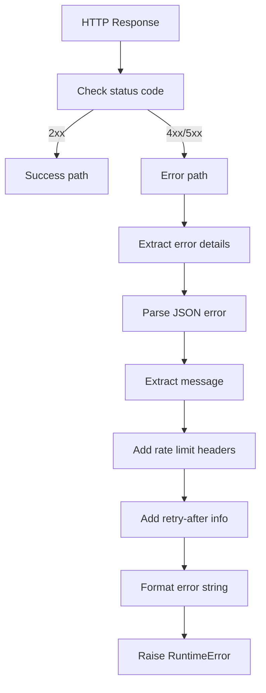

### Network Error Handling

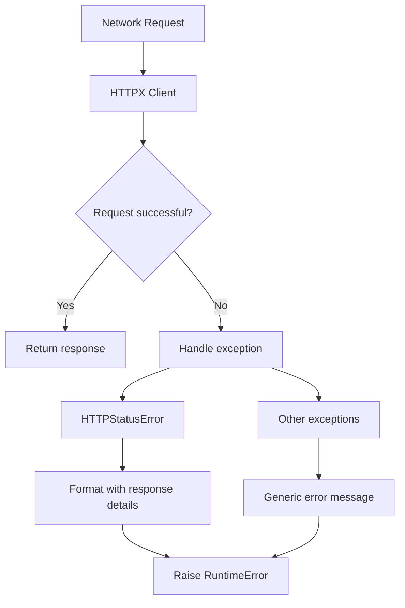

## Configuration and Constants

### Environment Variables

| Variable | Default | Description |
|----------|---------|-------------|
| `CODEX_AUTH_FILE` | `~/.codex/auth.json` | Path to auth file |
| `CODEX_CACHE_DIR` | `~/.opencode/cache` | Instruction cache directory |
| `CODEX_MODE` | `True` | Enable Codex-specific features |

### API Endpoints

| Endpoint | Purpose | Timeout |
|----------|---------|---------|
| `https://chatgpt.com/backend-api/codex/responses` | Main API endpoint | 60s |
| `https://auth.openai.com/oauth/token` | Token refresh | 20s |
| `https://api.github.com/repos/openai/codex/releases/latest` | Get latest release | 20s |

### Model Mapping Constants

```python
MODEL_EFFORT_SUFFIXES = ("none", "minimal", "low", "medium", "high", "xhigh")
BASE_MODELS = ("gpt-5.1-codex", "gpt-5.1-codex-max", "gpt-5.1-codex-mini", "gpt-5.1")
```

## Performance Optimizations

### Caching Strategy

1. **Token Caching**: 5-minute buffer before expiry
2. **Instruction Caching**: 15-minute TTL with ETag support
3. **Model Mapping**: Static dictionary (O(1) lookup)

### Connection Management

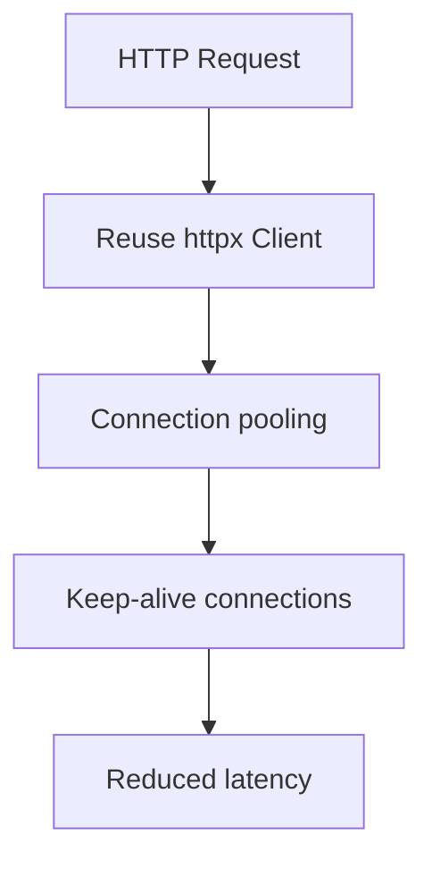

## Security Considerations

### Token Security

- Tokens stored in user home directory with appropriate permissions
- Memory caching with automatic expiration
- No token logging or persistence beyond necessary

### Request Security

- HTTPS-only communication
- Proper header sanitization
- Input validation for all parameters

### Error Information

- Detailed error messages for debugging
- Rate limit information preservation
- No sensitive data in error responses
