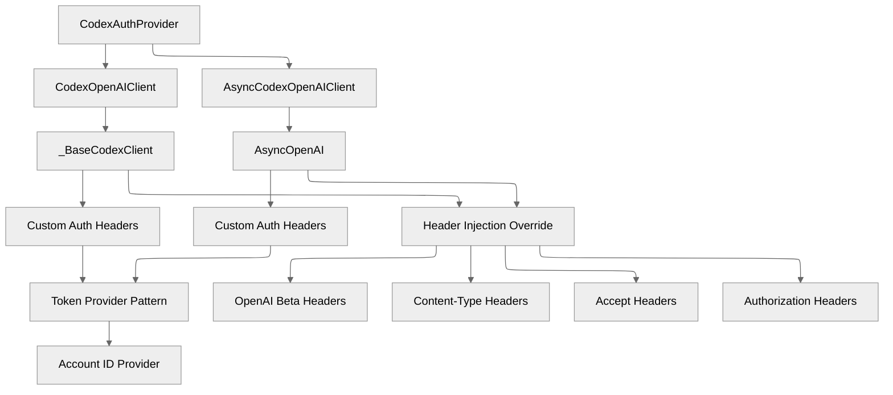
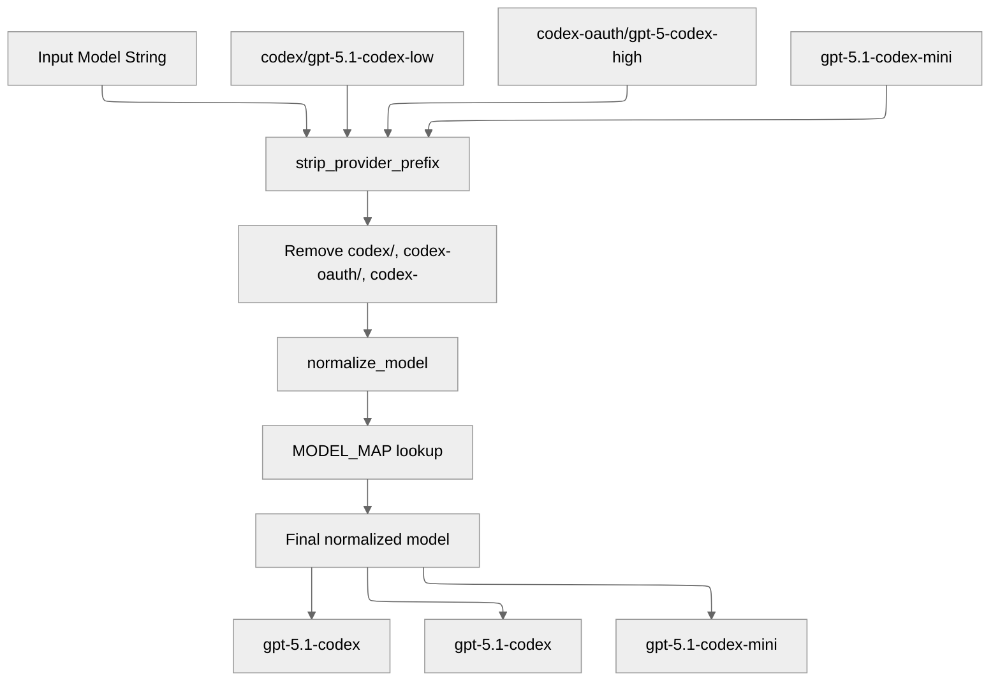

# Codex API Integration Details

This document provides comprehensive details about how the provider wraps the Codex backend API using the official OpenAI client library, including request/response handling, authentication flow, and internal processing details.

## Codex Backend API Overview

The provider acts as a sophisticated adapter between LiteLLM's OpenAI-compatible interface and the ChatGPT backend API through the official OpenAI client library. It handles the complete request/response lifecycle while maintaining compatibility with both systems.

## OpenAI Client Integration Architecture

### Custom OpenAI Client Implementation

The provider uses a custom OpenAI client that extends the official OpenAI client with Codex-specific authentication and header injection:



### Token Provider Pattern

The OpenAI client uses a token provider pattern for dynamic authentication:

```python
class _BaseCodexClient(OpenAI):
    def __init__(
        self,
        *,
        token_provider: Callable[[], str],
        account_id_provider: Callable[[], str | None],
        base_url: str,
        timeout: float = 60.0,
        http_client: httpx.Client | None = None,
        **kwargs: Any,
    ) -> None:
        # Initialize with empty API key - we'll inject auth headers
        super().__init__(
            api_key="",
            base_url=base_url,
            timeout=timeout,
            http_client=client,
            **kwargs,
        )
        self._token_provider = token_provider
        self._account_id_provider = account_id_provider
```

### Custom Header Injection

The provider overrides the `_prepare_options` method to inject Codex-specific headers:

```python
@override
def _prepare_options(self, options: FinalRequestOptions) -> FinalRequestOptions:
    prepared = super()._prepare_options(options)
    headers = httpx.Headers(prepared.headers or {})

    # Inject dynamic token
    token = self._token_provider()
    if token:
        headers["Authorization"] = f"Bearer {token}"

    # Inject Codex-specific headers
    headers.setdefault("OpenAI-Beta", "responses=experimental")
    headers.setdefault("originator", "codex_cli_rs")
    headers.setdefault("Content-Type", "application/json")
    headers["Accept"] = "text/event-stream"

    # Inject account ID if available
    account_id = self._account_id_provider() or ""
    if account_id:
        headers.setdefault("chatgpt-account-id", account_id)

    return prepared.copy(update={"headers": headers})
```

## Request Processing Details

### Model Normalization Process

The provider performs intelligent model name normalization to map LiteLLM model strings to Codex-compatible identifiers:



### Request Payload Construction

The provider transforms LiteLLM parameters into Codex API payloads:

```python
def _build_payload(
    self,
    *,
    model: str,
    instructions: str,
    messages: list[dict[str, Any]],
    prompt_cache_key: str | None,
    reasoning_config: dict[str, Any],
    **kwargs: Any,
) -> dict[str, Any]:
```

#### Payload Structure

The provider transforms LiteLLM parameters into Codex API payloads by extracting optional parameters, normalizing tools, and building a comprehensive payload that includes the model, input messages, instructions, reasoning configuration, and any additional options.

**Key Payload Fields:**

| Field | Type | Description | Source |
|-------|------|-------------|---------|
| `model` | `str` | Normalized Codex model identifier | Model mapping |
| `input` | `list[dict]` | Transformed message array | Message conversion |
| `instructions` | `str` | System instructions | Remote resources |
| `tools` | `list[dict]` | Normalized tool definitions | Tool processing |
| `reasoning.effort` | `str` | Reasoning effort level | Config application |
| `text.verbosity` | `str` | Response verbosity | Config application |
| `include` | `list[str]` | Include encrypted reasoning | Constants |
| `stream` | `bool` | Enable streaming | Always `True` |

### Message Transformation

The provider converts OpenAI message format to Codex input format through role-based processing:

**Message Type Conversions:**

| OpenAI Role | Codex Type | Transformation |
|-------------|------------|----------------|
| `system` | `instructions` | Filtered and combined |
| `user` | `message` | Direct conversion |
| `assistant` | `message` | Direct conversion |
| `tool` | `function_call_output` | Special handling |
| `function` | `function_call` | Legacy support |

System messages are filtered to remove toolchain prompts and added to the instructions, while user and assistant messages are converted directly to Codex format. Tool messages are handled specially as function call outputs.

### Tool Bridge Logic

When tools are present, the provider prepends a special bridge prompt to enable function calling capabilities. This bridge message instructs the model on how to use the provided tools and format its responses appropriately.

## Response Processing Details

The provider handles multiple response formats from the Codex backend, including Server-Sent Events (SSE) streaming and standard JSON responses. The system automatically detects the response type and applies appropriate parsing strategies, with fallback mechanisms to ensure robust operation across different response formats.

## Authentication Flow Details

The authentication system manages the complete token lifecycle, from initial extraction to automatic refresh when tokens expire. The provider uses a token provider pattern for dynamic authentication, ensuring that fresh tokens are always available for API requests.

### JWT Account ID Extraction

Access tokens contain JWT claims that include the ChatGPT account ID. The provider automatically extracts this information by parsing the JWT payload and decoding the base64-encoded claims to retrieve the account identifier needed for API requests.

## HTTP Dispatch Architecture

The provider uses the official OpenAI client library for HTTP communication, with automatic fallback mechanisms for robust operation. When the OpenAI client encounters issues, the system can fall back to direct HTTP requests using httpx for continued operation.

## Error Handling Strategy

The provider implements comprehensive error handling for both HTTP errors and network issues. Error responses are parsed and formatted to provide meaningful information while preserving rate limit headers and retry-after information for client applications.

## Remote Resources Management

The provider manages dynamic instruction fetching and caching from GitHub releases. Instructions are cached with a 15-minute TTL and ETag support to minimize unnecessary network requests while ensuring users receive the most up-to-date instructions for their chosen model family.

## Configuration and Constants

### Environment Variables

| Variable | Default | Description |
|----------|---------|-------------|
| `CODEX_AUTH_FILE` | `~/.codex/auth.json` | Path to auth file |
| `CODEX_CACHE_DIR` | `~/.opencode/cache` | Instruction cache directory |
| `CODEX_MODE` | `True` | Enable Codex-specific features |
| `CODEX_DEBUG` | `False` | Enable debug logging |

### API Endpoints

| Endpoint | Purpose | Timeout |
|----------|---------|---------|
| `https://chatgpt.com/backend-api/codex/responses` | Main API endpoint | 60s |
| `https://auth.openai.com/oauth/token` | Token refresh | 20s |
| `https://api.github.com/repos/openai/codex/releases/latest` | Get latest release | 20s |

### Model Mapping Constants

```python
MODEL_EFFORT_SUFFIXES = ("none", "minimal", "low", "medium", "high", "xhigh")
BASE_MODELS = ("gpt-5.1-codex", "gpt-5.1-codex-max", "gpt-5.1-codex-mini", "gpt-5.1")
```

## Performance Optimizations

The provider implements several performance optimizations:

1. **Token Caching**: 5-minute buffer before expiry
2. **Instruction Caching**: 15-minute TTL with ETag support
3. **Model Mapping**: Static dictionary (O(1) lookup)
4. **Connection Reuse**: OpenAI client manages connection pooling
5. **Typed Model Validation**: OpenAI typed models for reliable parsing
6. **Fallback Mechanisms**: Multiple parsing strategies for robustness

## Security Considerations

### Token Security

- Tokens stored in user home directory with appropriate permissions
- Memory caching with automatic expiration
- No token logging or persistence beyond necessary

### Request Security

- HTTPS-only communication
- Proper header sanitization
- Input validation for all parameters

### Error Information

- Detailed error messages for debugging
- Rate limit information preservation
- No sensitive data in error responses

## Customization Points

### Custom OpenAI Client

Extend the OpenAI client customization:

```python
class CustomCodexClient(CodexOpenAIClient):
    def _prepare_options(self, options: FinalRequestOptions) -> FinalRequestOptions:
        prepared = super()._prepare_options(options)
        # Add custom headers or modifications
        headers = httpx.Headers(prepared.headers or {})
        headers["Custom-Header"] = "custom-value"
        return prepared.copy(update={"headers": headers})
```

### Custom Response Adapter

Override response transformation:

```python
def custom_transform_response(openai_response: dict[str, Any], model: str) -> ModelResponse:
    # Custom transformation logic
    return transform_response(openai_response, model)
```

### Custom Model Mapping

Extend model normalization:

```python
# Add custom model aliases
alias_bases = {
    "custom-model": "target-base-model",
    # ... more aliases
}
```

This architecture provides a robust, maintainable, and extensible foundation for integrating Codex authentication with OpenAI-compatible APIs while maintaining full compatibility with the LiteLLM ecosystem.
